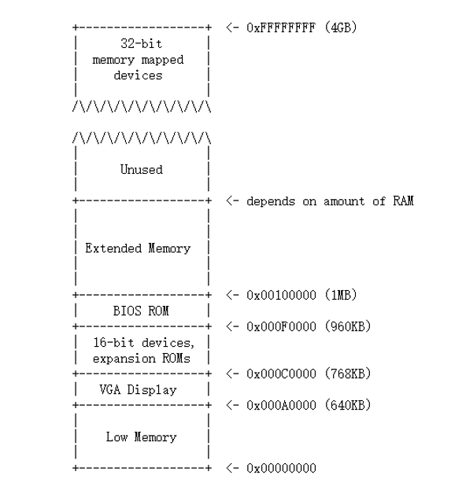
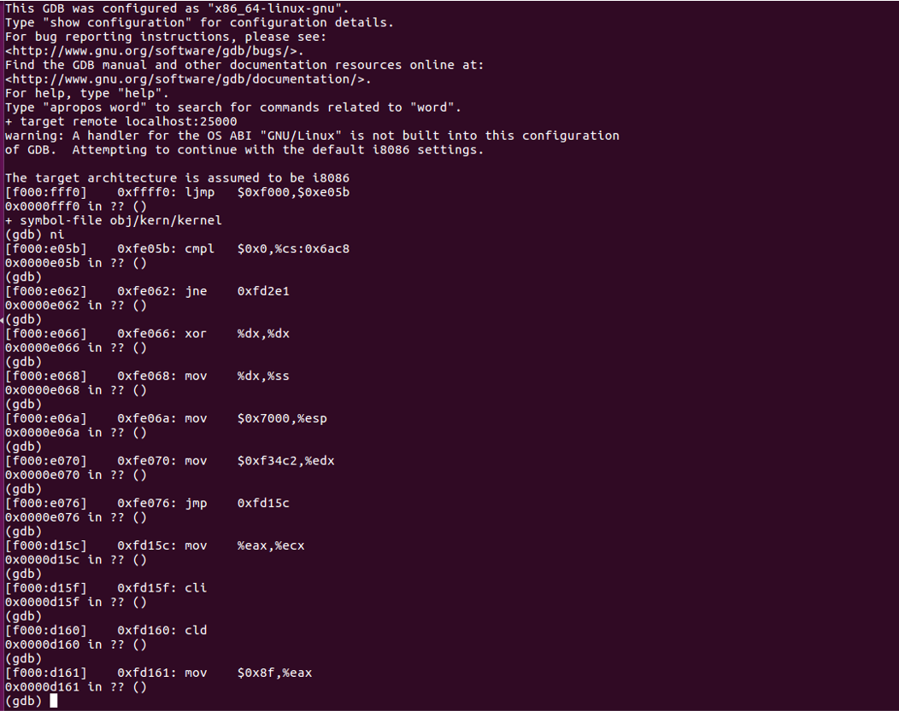
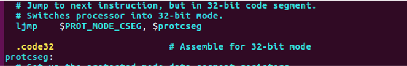
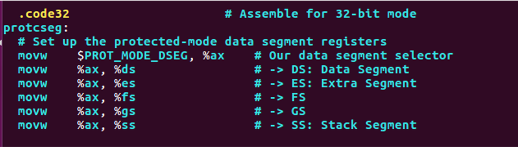
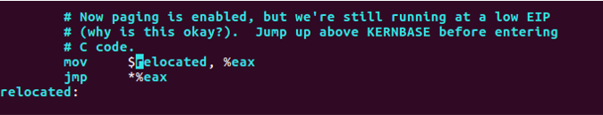
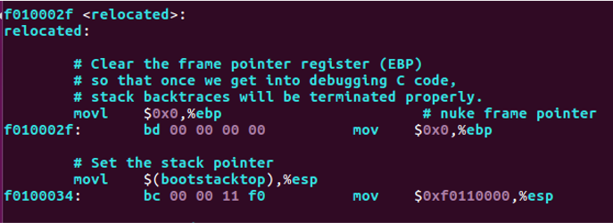

# Booting a PC

***

## Overview

***

This post records my experiment process which was based on `MIT 6.828`. Basically, the order of the introduction in this post follows the sequence of the implementation periods.

What's more, I think one of my best friend achieve a better review job. This is [his post](https://elliotqi.top/2021/03/03/1-lab-1-booting-a-pc/)

## Recommended Books

***

* CSAPP
* 汇编语言（王爽）
* 程序员的自我修养：装载、链接和库

## Preliminary Knowledges

***

### Layout of physical address space

***



* The first PCs, which were based on the 16-bit Intel 8088 processor, were only capable of addressing 1MB of physical memory. \(0x00000000~0x000FFFFF\)
* "Low Memory" was the *only* random-access memory \(RAM\) that an early PC could use
* The 384KB area from 0x000A0000 ~0x000FFFFF was reserved by the hardware for special uses such as video display buffers and firmware held in non-volatile memory. The most important part is the Basic Input/Output System \(BIOS\), which occupies the 64KB region from 0x000F0000~0x000FFFFF. In early PCs the BIOS was held in true ROM, but current PCs store the BIOS in updateable flash memory. 
* The BIOS is responsible for performing basic system initialization
* After performing this initialization, the BIOS loads the operating system from some appropriate location such as floppy disk, hard disk, CD-ROM, or the network, and passes control of the machine to the operating system.
* Modern PCs have a "hole" in physical memory from 0x000A0000~0x00100000, dividing RAM into "low" or "conventional memory" \(the first 640KB\) and "extended memory" \(everything else\). \(ensure backward compatibility with existing software.\)
* In addition, some space at the very top of the PC's 32-bit physical address space, above all physical RAM, is now commonly reserved by the BIOS for use by 32-bit PCI devices.
* Because of design limitations JOS will use only the first 256MB of a PC's physical memory anyway, so for now we will pretend that all PCs have "only" a 32-bit physical address space.

### GDT

***


* SEG is used to construct GDT, which is defined in `mmu.h.`
* At the boot loader part in the experiment process, we look back to this.

### CR registers family

***

## Process

***


* Layout picture about CR registers family.
* CR family is one of the important themes  about booting process, we will meet the member of `CR` family many times.

### BIOS

***

After we enter into JOS\(experiment platform used in this class\), we can walk around and check what we got.



* We can read these instructions to figure out what had happened at the very beginning of booting a PC. At this stage, BIOS is our main character.
* There are so many complicated jobs. And I just have look through several beginning steps roughly, then I jumped over this process.
* To jump over this process, set a breakpoint at `0x7c00`, then let it go, it will head to the entry point of next stage.

### The Boot Loader

***

* The main tasks of the boot loader can be concluded as two parts: switch mode and load the kernel.
  * First, the boot loader switches the processor from real mode to 32-bit protected mode, because it is only in this mode that software can access all the memory above 1MB in the processor's physical address space. 
  * Second, the boot loader reads the kernel from the hard disk by directly accessing the IDE disk device registers via the x86's special I/O instructions. 
* Boot loader is loaded by the former process and called by the former main character: BIOS.
* Here are some basic knowledges:
  * Floppy and hard disks for PCs are divided into 512 byte regions called *sectors*. A sector is the disk's minimum transfer granularity: each read or write operation must be one or more sectors in size and aligned on a sector boundary.
  * If the disk is bootable, the first sector is called the *boot sector*
* Here is my experiment result at this stage:


#### Switch Mode

***


* Disable interrupts & String Operations increment.
* Clear segment registers.


* Enable A20 \(polling method\).
* `lgdt gdtdesc` load information in `gdtdesc` \(next slide\) into GDTR\(in CPU\).
* After that use three instructions to set up `cr0`’s lowest(0) bit \(PE, protected mode enable\).
* `Ljmp $PROT_MODE_CSEG, $protcseg` simply jump to next instruction, but in 32-bit code segment. Switches processor into 32-bit mode. We can check this at following picture.



* The relevant knowledge about `GDT` and `cr` registers family, we can check at the preliminary knowledge section.




* Here comes the highlight part of this periods: set up the protected-mode data segment registers.


* We are now at the end of the `boot loader`. We have to assign the control to the next part.
* If something went wrong, loop.

#### Loading The Kernel

***

* Kernel image must be ELF format("Executable and Linkable Format")(More details: 程序员的自我修养）
* VMA(link address) & LMA(load address)
* The link address of a section is the memory address from which the section expects to execute.
* The linker encodes the link address in the binary in various ways, such as when the code needs the address of a global variable, with the result that a binary usually won't work if it is executing from an address that it is not linked for. (Modern PIC tech is used solve this)
* Typically, the link and load addresses are the same. 
* The source code of this part is in `main.c`, we can check the simplify introduction at its beginning:


We are going to travel through this file and gain the insight about the process which is aimed at loading the kernel.


* Read 'count' (para) from kernel image into physical address 'pa'(para).
* Using `readsect`:


* `readsect` using a 'low-level' method to achieve the target that reading a sector into physical address space.
* `waitdisk` using the idea of `polling`.


* `"readseg((uint32_t) ELFHDR, SECTSIZE*8, 0);"`reading the first page (1 page= 8sectors).
* `ELF_MAGIC`, member of `ELF32(64)_Ehdr`, contained in the member e_ident . The beginning 4 bytes is `0x7F, 0x45, 0x4c, 0x46`.(In ascii, DEL, 'E', 'L', 'F'.).
* Interesting fact `a.out` is 0x1, 0x7; PE/COFF is 0x4d, 0x5a aka 'M', 'Z' in ascii.
* `ELF32_Ehdr` tell us `e_phoff` (start of program headers) and `e_phnum`(Number of program headers). Using this to index the program headers in the kernel image. 
* Using members in `Elf32_Phdr`(program header), `p_pa`(physical, LMA), `p_memsz`(size of segment), `p_offset`(offset of segment in kernel image).
* `e_entry`, the member of `Elf32_Ehdr`. (VMA of the entry, for relocatable file aka `*.o` in linux `*.obj` in windows, is 0). 


* Deeper into base, we can check the content in `obj/boot/boot.asm` which came from `boot.S` and `main.c` after compilation. 
* Loading the kernel into disk involved with plenty of `I/O` operation, and it need lots of knowledge about the base of the system. Here, I highly recommended you read it but in a overview way. 
* Take a notice on the address, when we travel through `qemu-gdb`, we can check the consistence about the address.
* Step further, give an eye about following variation about the content in address `0x100000` which reveal the changing of memory mode.


* The phenomenon above showed that the success about mode switching and the right of control has been transferred to the main character of the next stage: kernel

### Kernel

***

At first, go around in the `gdb`, you can check new change about the content inferred by the same address when we pass by some 'magic' instructions.


* Attention at the content at `0xf0100000` and `0x100000`. Check the difference around the "magic instructions":

```assembly
mov $0xf010002f, %eax
```

* Same as before, this variation revealed the mapping method has been changed.
* Actually the instruction above isn't the core part of the magic, it's just the "signal step" which represents the conversion between former mapping method to virtual memory mapping.
* New mapping mechanism was actually set up at the moment just after `mov %eax, %cr0`
* Let's step further in the source code to dig more detail about this "magic".


* Use `eax` to load the physical address of `entry_pgdir` into cr3 which is defined in `entrypgdir.c.` From `gdb` we can tell that `entry_pgdir` is `0x110000`. We can also check this from `obj/kern/kernel.asm`
* And we're gonna set cr0 with `orl $(CR0_PE|CRP_PG|CRP_WP)` PE represents "protection enable", PG represents "Paging", and WP represents "Write Protect". After that, the new mapping is established. (Look back to the picture at preliminary knowledge)




* What happened here is the same as what had happened when we entered into protection mode. Just jump to the next instruction. 


There is still a final task needs to be done by kernel: build up the stack.




The process obey the following steps:

* Clear `ebp`.
* Set `esp`(we can check it at `obj/kern/kernel.asm`)
* note here: KSTKSIZE=8 page size
* Parameter about the stack JOS build
  * Virtual address: `0xf0108000-0xf0110000`
  * Physical address: `0x00108000-0x00110000`


And here is a schematic diagram about the layout of the stack:


## To be continued

***

This paper ignore plenty of details about Lab 1, such as `VA_LIST` part and etc. 