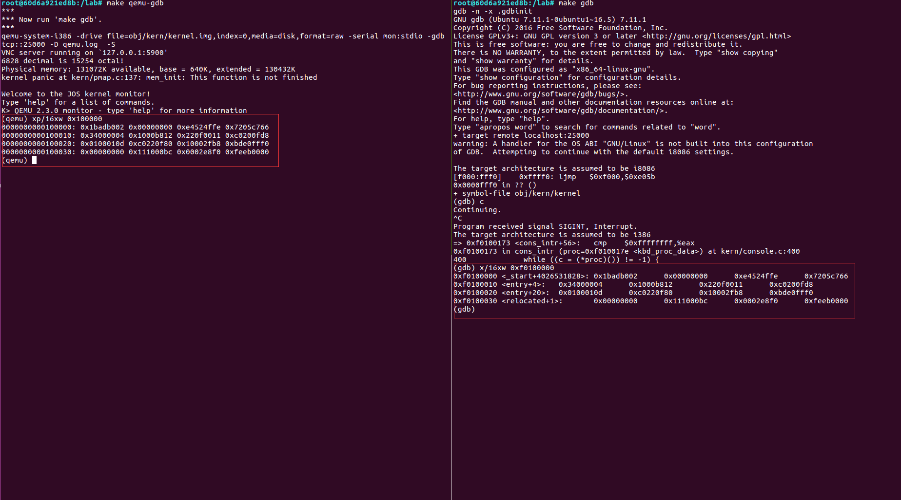
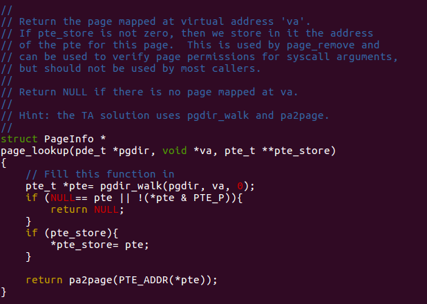
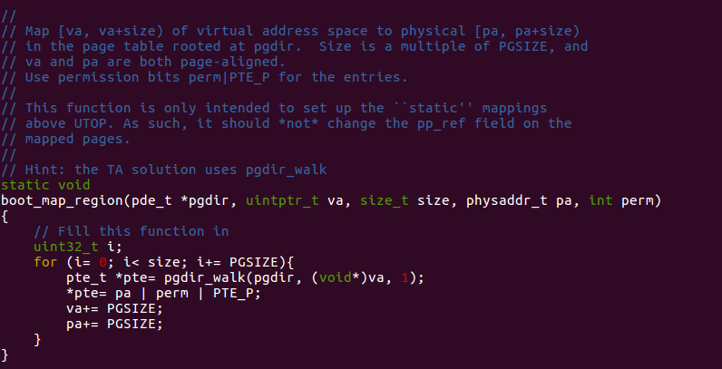

# Lab 2: Memory Management

***

## Overview

***

After a long time I've finished Lab 2's task, here I take the notes about my experiment process. This post mainly shows some subtle principle behind the we programmer can use limited memory freely without worrying about causing security trouble. In my opinion, this is totally an art of space management.

## Entire Layout Of Virtual Address Space

***

We can check the design about layout that JOS uses in `inc/memlayout.h`. And there are lots of useful   Macro which help us locate the position in virtual address space. 

The region above `UTOP` is the main stage in lab 2. As for `Invalid Memory` mentioned in the picture. According to the comment is function `mem_init`, which is the main character in this lab, it's a "guard page" to monitor.

 ## Experiment Process

***

Nowadays, operating system using virtual memory to manage the limit physics resources to satisfy the demand from the real situation in application that required by multi-process. In JOS, the specific method to achieve protected-mode memory management is the combination of **segmentation and page translation**. Here is a [Link](https://pdos.csail.mit.edu/6.828/2018/readings/i386/c05.htm) introduce details about this method. Honestly, I was deeply amazed by its subtle design at first sight, although it's also really confused to me.

As shown above, the entire translation divided into two steps. 

First, with the **Selector** in the visible part of segment registers and **Offset** which is used as **C Pointer** by programmer, we can fetch a  **Linear Address**. **GDT & LGDT** are the main characters at segmentation translation part. It's detail had been handled pretty well at lab 1. (In `boot/boot.S`, we installed a Global Descriptor Table (GDT) that effectively disabled segment translation by setting all segment base addresses to 0 and limits to `0xffffffff`. Hence the "selector" has no effect and the linear address always equals the offset of the virtual address. )

The second is what we have to care about. As mentioned in the upper link, 80386 use Two levels of tables  to address a page of memory. **cr3** act similar to what GDT & LGDT act in segmentation translation but not the same. More details, the upper link showed pretty well. We aren't wasting time at here.

### Part 1 Before Paging: Physical Page Management

***

Before we gonna using page table, where exactly it was? The answer is we have to allocate that part by ourselves at the very beginning.

Let's check about our main character: `mem_init`

The code calling `i386_detect_memory` needs to read this device hardware in order to figure out how much physical memory there is, but that part of the code is done for you: you do not need to know the details of how the CMOS hardware works. 

The operating system must keep track of which parts of physical RAM are free and which are currently in use. JOS manages the PC's physical memory with *page granularity* so that it can use the MMU to map and protect each piece of allocated memory.

We'll now write the physical page allocator. It keeps track of which pages are free with a linked list of `struct PageInfo` objects (which, unlike xv6, are *not* embedded in the free pages themselves), each corresponding to a physical page. You need to write the physical page allocator before you can write the rest of the virtual memory implementation, because your page table management code will need to allocate physical memory in which to store page tables.

Because we haven't allocate page table yet, so before we can *allocate page*, we have to use some primal method: `boot_alloc`. As shown in comment, after we use this method allocate space for *kernel page directory* and an array of  `struct PageInfo` which is used to record information about physical pages, we must abandon this method and using the operation family related to pages management. 

Follow the guidance in the comment, my solution about this function were shown above. The tricky part is `end` array, you can find more details in the `*.ld` file. This trick assign our beginning of free memory to the kernel's end of `.bss` segment.

Our `boot_alloc` help us allocate space for *kernel page directory* and an array of  `struct PageInfo`. Then, let's initialize our allocated array.

Although we're manipulating an array, however, for more flexible allocate pages, we use a link list to manage this array. And pay attention to the comments, it gave us the detailed instructions about which pages were free, which pages were occupied.

Naturally, we can use page as manipulation unit. My solution was shown below.

I recommend you use `assert` to alert too.

### Part 2: Virtual Memory

***

As mention before, modern operation system use this mechanism to manage the memory. This part is the highlight in this lab, we're gonna achieve lots of tool function used for this management by ourselves. And this part requires very clear knowledge about the upper tutorial in the link about **segmentation and page translation**.

Recall that in part 3 of lab 1, we installed a simple page table so that the kernel could run at its link address of 0xf0100000, even though it is actually loaded in physical memory just above the ROM BIOS at 0x00100000. This page table mapped only 4MB of memory. In the virtual address space layout you are going to set up for JOS in this lab, we'll expand this to map the first 256MB of physical memory starting at virtual address 0xf0000000 and to map a number of other regions of the virtual address space. 

Here are some details have to be noticed. The JOS kernel often needs to manipulate addresses as opaque values or as integers, without dereferencing them, for example in the physical memory allocator. Sometimes these are virtual addresses, and sometimes they are physical addresses. To help document the code, the JOS source distinguishes the two cases: the type `uintptr_t` represents opaque virtual addresses, and `physaddr_t` represents physical addresses. Both these types are really just synonyms for 32-bit integers (`uint32_t`), so the compiler won't stop you from assigning one type to another! Since they are integer types (not pointers), the compiler *will* complain if you try to dereference them.

The JOS kernel can dereference a `uintptr_t` by first casting it to a pointer type. In contrast, the kernel can't sensibly dereference a physical address, since the MMU translates all memory references. If you cast a `physaddr_t` to a pointer and dereference it, you may be able to load and store to the resulting address (the hardware will interpret it as a virtual address), but you probably won't get the memory location you intended.

We can check this by using `gdb` and `qemu`.

And in future labs we will often have the same physical page mapped at multiple virtual addresses simultaneously (or in the address spaces of multiple environments). We will keep a count of the number of references to each physical page in the `pp_ref` field of the `struct PageInfo` corresponding to the physical page. When this count goes to zero for a physical page, that page can be freed because it is no longer used. In general, this count should be equal to the number of times the physical page appears *below `UTOP`* in all page tables (the mappings above `UTOP` are mostly set up at boot time by the kernel and should never be freed, so there's no need to reference count them). We'll also use it to keep track of the number of pointers we keep to the page directory pages and, in turn, of the number of references the page directories have to page table pages.

At first, let's implement two "searching funciton"

These function return the page table entry for inquired virtual address(more specifically, it's linear address). It will create a new page table if `create` is set and there didn't exist corresponding page table entry before asking.

And with the help of `pgdir_walk` we can implement the other "searching function"

This function returns `struct PageInfo` which contains the information about the physical page corresponding to the virtual address, and if necessary, it will fetch page table entry by `pte_store`.

Before we design a "insert" function, we have to design a "remove" function, because we have to prepare a space for the page we have to insert.

Check about `page_decref` function, it helps update `pp_ref`  for us.

And here is the function needs to be careful: "insert".

As mentioned in the comments, we've considered the corner case mentioned in it. And handle everything in one code path way. However, we must update `pp_ref` before we remove existed page. Because, if the order is reversed, after `page_remove`, that physical page might be recycled incorrectly.

Next function used for allocate space for kernel part in the virtual address space.

Just follow the advice in comment, and remember, do **not** update `pp_ref` field in this function. It should be done by its sub-function.

### Part 3: Kernel Address Space

***

Since kernel and user memory are both present in each environment's address space, we will have to use permission bits in our x86 page tables to allow user code access only to the user part of the address space. Otherwise bugs in user code might overwrite kernel data, causing a crash or more subtle malfunction; user code might also be able to steal other environments' private data. Note that the writable permission bit (`PTE_W`) affects both user and kernel code!

The user environment will have no permission to any of the memory above `ULIM`, while the kernel will be able to read and write this memory. For the address range `[UTOP,ULIM)`, both the kernel and the user environment have the same permission: they can read but not write this address range. This range of address is used to expose certain kernel data structures read-only to the user environment. Lastly, the address space below `UTOP` is for the user environment to use; the user environment will set permissions for accessing this memory.

In a word, we have to achieve permissions and fault isolation.

Follow the advice in comment, we can achieve the easiest task in lab 2.

## Others

***

Attention here, before use `make grade`, be sure you've remove **panic** lines mentioned in `mem_init`. It seems like this:

And this is the grade if you've correctly achieve the tasks in lab2:

