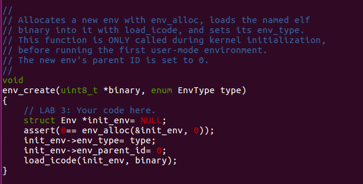
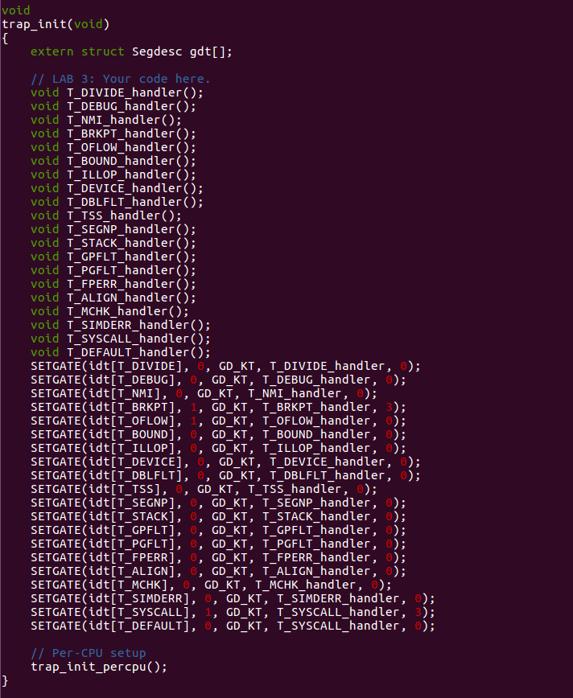
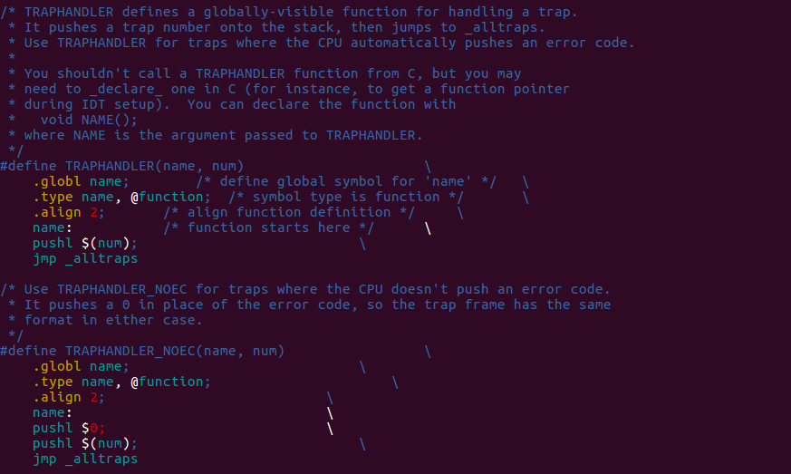
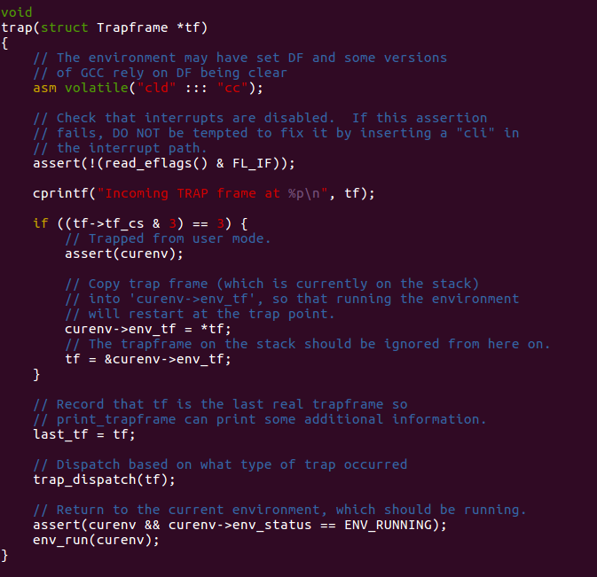
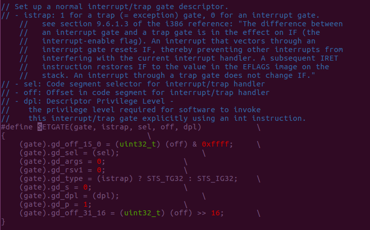
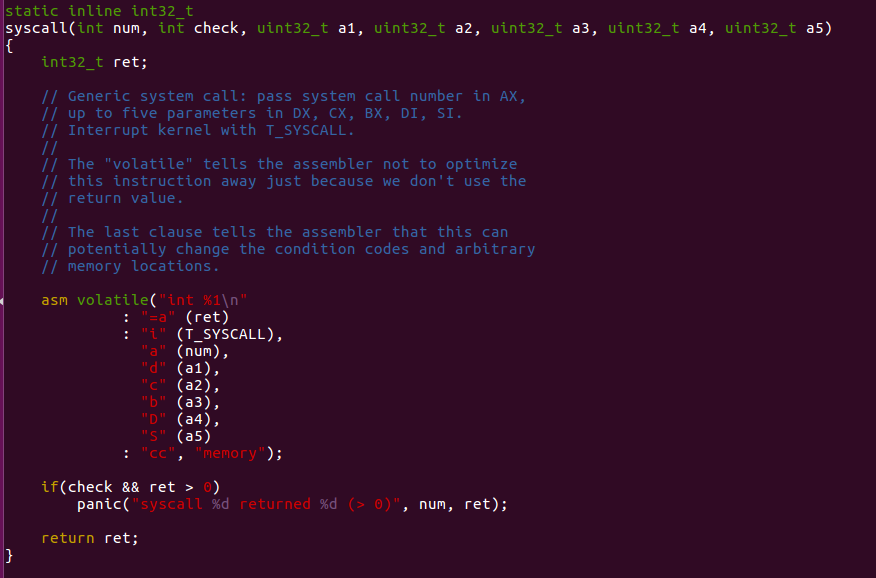
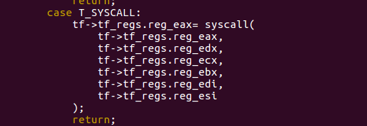
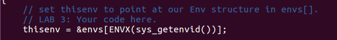

# Lab 3 User Environment

***

## Overview

***

**Process** is one of the most important concept in operating system. And it helps us manage our program with the guarantee in lots of aspects such as security, independency and etc. Naturally, operating system divide running state into different modes: user mode and kernel mode. And this is what we gonna do in this lab: implement the basic kernel facilities required to get a protected user-mode process running. We should take a note here that JOS mangle its process as "environment"(*We introduce the term "environment" instead of the traditional term "process" in order to stress the point that JOS environments and UNIX processes provide different interfaces, and do not provide the same semantics.*, quoted from 6.828). 

We will enhance the JOS kernel to set up the data structures to keep track of user environments, create a single user environment, load a program image into it, and start it running. These data structures helps us run our system in perfect order.

What's more, we will also have the chance to make the JOS kernel capable of handling any system calls the user environment makes and handling any other exceptions it causes.

## Preliminary

***

### PCB

***

CPU only run one process at a time until its end is far beyond our demand. Instead, we'll manage our processes running in turn. So it's really necessary to have a record for "living" process. There is no doubt this job fell to operating system. 

We need to design a data structure for the most key information of process. And here is our PCB:

```c
// PCB for JOS
struct Env {
	struct Trapframe env_tf;	// Saved registers
	struct Env *env_link;		// Next free Env
	envid_t env_id;			// Unique environment identifier
	envid_t env_parent_id;		// env_id of this env's parent
	enum EnvType env_type;		// Indicates special system environments
	unsigned env_status;		// Status of the environment
	uint32_t env_runs;		// Number of times environment has run

	// Address space
	pde_t *env_pgdir;		// Kernel virtual address of page dir
};
```

And here's what the `Env` fields are for:

> **env_tf**:
>
> This structure, defined in `inc/trap.h`, holds the saved register values for the environment while that environment is *not* running: i.e., when the kernel or a different environment is running. The kernel saves these when switching from user to kernel mode, so that the environment can later be resumed where it left off.
>
> **env_link**:
>
> This is a link to the next `Env` on the `env_free_list`. `env_free_list` points to the first free environment on the list.
>
> **env_id**:
>
> The kernel stores here a value that uniquely identifiers the environment currently using this `Env` structure (i.e., using this particular slot in the `envs` array). After a user environment terminates, the kernel may re-allocate the same `Env` structure to a different environment - but the new environment will have a different `env_id` from the old one even though the new environment is re-using the same slot in the `envs` array.
>
> **env_parent_id**:
>
> The kernel stores here the `env_id` of the environment that created this environment. In this way the environments can form a “family tree,” which will be useful for making security decisions about which environments are allowed to do what to whom.
>
> **env_type**:
>
> This is used to distinguish special environments. For most environments, it will be `ENV_TYPE_USER`. We'll introduce a few more types for special system service environments in later labs.
>
> **env_status**:
>
> This variable holds one of the following values:
>
> - `ENV_FREE`:
>
>   Indicates that the `Env` structure is inactive, and therefore on the `env_free_list`.
>
> - `ENV_RUNNABLE`:
>
>   Indicates that the `Env` structure represents an environment that is waiting to run on the processor.
>
> - `ENV_RUNNING`:
>
>   Indicates that the `Env` structure represents the currently running environment.
>
> - `ENV_NOT_RUNNABLE`:
>
>   Indicates that the `Env` structure represents a currently active environment, but it is not currently ready to run: for example, because it is waiting for an interprocess communication (IPC) from another environment.
>
> - `ENV_DYING`:
>
>   Indicates that the `Env` structure represents a zombie environment. A zombie environment will be freed the next time it traps to the kernel. We will not use this flag until Lab 4.
>
> **env_pgdir**:
>
> This variable holds the kernel *virtual address* of this environment's page directory.

The data structure `Trapframe` has been mentioned above holds user-mode register state. **Note**: In JOS, individual environments do not have their own kernel stacks as processes do in xv6. There can be only one JOS environment active in the kernel at a time, so JOS needs only a *single* kernel stack.

### Basics of Protected Control Transfer

***

Exceptions and interrupts are both "protected control transfers," which cause the processor to switch from user to kernel mode (CPL=0) without giving the user-mode code any opportunity to interfere with the functioning of the kernel or other environments. In Intel's terminology, an *interrupt* is a protected control transfer that is caused by an asynchronous event usually external to the processor, such as notification of external device I/O activity. An *exception*, in contrast, is a protected control transfer caused synchronously by the currently running code, for example due to a divide by zero or an invalid memory access.

In order to ensure that these protected control transfers are actually *protected*, the processor's interrupt/exception mechanism is designed so that the code currently running when the interrupt or exception occurs *does not get to choose arbitrarily where the kernel is entered or how*. Instead, the processor ensures that the kernel can be entered only under carefully controlled conditions. On the x86, two mechanisms work together to provide this protection:

1. **The Interrupt Descriptor Table.** The processor ensures that interrupts and exceptions can only cause the kernel to be entered at a few specific, well-defined entry-points *determined by the kernel itself*, and not by the code running when the interrupt or exception is taken.

   The x86 allows up to 256 different interrupt or exception entry points into the kernel, each with a different *interrupt vector*. A vector is a number between 0 and 255. An interrupt's vector is determined by the source of the interrupt: different devices, error conditions, and application requests to the kernel generate interrupts with different vectors. The CPU uses the vector as an index into the processor's *interrupt descriptor table* (IDT), which the kernel sets up in kernel-private memory, much like the GDT. From the appropriate entry in this table the processor loads:

   - the value to load into the instruction pointer (`EIP`) register, pointing to the kernel code designated to handle that type of exception.
   - the value to load into the code segment (`CS`) register, which includes in bits 0-1 the privilege level at which the exception handler is to run. (In JOS, all exceptions are handled in kernel mode, privilege level 0.)

2. **The Task State Segment.** The processor needs a place to save the *old* processor state before the interrupt or exception occurred, such as the original values of `EIP` and `CS` before the processor invoked the exception handler, so that the exception handler can later restore that old state and resume the interrupted code from where it left off. But this save area for the old processor state must in turn be protected from unprivileged user-mode code; otherwise buggy or malicious user code could compromise the kernel.

   For this reason, when an x86 processor takes an interrupt or trap that causes a privilege level change from user to kernel mode, it also switches to a stack in the kernel's memory. A structure called the *task state segment* (TSS) specifies the segment selector and address where this stack lives. The processor pushes (on this new stack) `SS`, `ESP`, `EFLAGS`, `CS`, `EIP`, and an optional error code. Then it loads the `CS` and `EIP` from the interrupt descriptor, and sets the `ESP` and `SS` to refer to the new stack.

   Although the TSS is large and can potentially serve a variety of purposes, JOS only uses it to define the kernel stack that the processor should switch to when it transfers from user to kernel mode. Since "kernel mode" in JOS is privilege level 0 on the x86, the processor uses the `ESP0` and `SS0` fields of the TSS to define the kernel stack when entering kernel mode. JOS doesn't use any other TSS fields.

### Types of Exceptions and Interrupts

***

All of the synchronous exceptions that the x86 processor can generate internally use interrupt vectors between 0 and 31, and therefore map to IDT entries 0-31. For example, a page fault always causes an exception through vector 14. Interrupt vectors greater than 31 are only used by *software interrupts*, which can be generated by the `int` instruction, or asynchronous *hardware interrupts*, caused by external devices when they need attention.

## Experiment

***

### Basic work

***

Just follow what we've done to handle `pages` array, and follow the instruction in comment.


Here we allocate memories for this array to manage our environments.


Finish the map follow the comment.

### Creating and Running Environments

***

You will now write the code in `kern/env.c` necessary to run a user environment. Because we do not yet have a filesystem, we will set up the kernel to load a static binary image that is *embedded within the kernel itself*. JOS embeds this binary in the kernel as a ELF executable image.

The Lab 3 `GNUmakefile` generates a number of binary images in the `obj/user/` directory. If you look at `kern/Makefrag`, you will notice some magic that "links" these binaries directly into the kernel executable as if they were `.o` files. The `-b binary` option on the linker command line causes these files to be linked in as "raw" uninterpreted binary files rather than as regular `.o` files produced by the compiler. (As far as the linker is concerned, these files do not have to be ELF images at all - they could be anything, such as text files or pictures!) If you look at `obj/kern/kernel.sym` after building the kernel, you will notice that the linker has "magically" produced a number of funny symbols with obscure names like `_binary_obj_user_hello_start`, `_binary_obj_user_hello_end`, and `_binary_obj_user_hello_size`. The linker generates these symbol names by mangling the file names of the binary files; the symbols provide the regular kernel code with a way to reference the embedded binary files.

This is a really fancy trick to handle the situation we standing at that file system isn't established. In a word, this method extract the program we want to run, and using intermediate symbols to embed the program into kernel.

Let's check out the function I've implemented.


Just the same as what we do in `lab2` about the initialization of page and corresponding link list, isn't it?


Every independent environment has its own "virtual memory index table", more specifically page directory. The process of setting up is similar to what we do in `lab2` in kernel, **except for** priority problem. The place lower then `UTOP` is vacant. And there is no need to call `page_alloc` again. `pp_ref` higher than `UTOP` don't have to maintain, because the only owner of it it's kernel **except for** `env_pgdir`.


This is how we allocate memory for user-mode environment.


This is similar to what we've done in Lab 1: check out the format of `elf` and follow it. Step by step, we can find how to map from a binary file(in `elf` format) to user's virtual address space.



Here is our first environment.


Here is a context switch function from current environment to the appointed environment `e`.

Here we can make a summary. Here is machine's "timeline":

* start (kern/entry.S)

* i386_init (kern/init.c)

  * cons_init
  * mem_init
  * env_init
  * trap_init(still incomplete at this point)
  * env_create
  * env_run
    * env_pop_tf

  

### Handling Interrupts and Exceptions

***

Our first job is to set up the IDT. We can read the information about the interrupts we need to set in `kern/trap.h`.

Here we gonna trick macro to achieve this marvelous and exciting job.

At first, we have a look at where IDT is defined.


It's a `struct Gatedesc` array.

Let's have a look at my final job, maybe you will be the same confused about these macros as me, but we'll figure out later:



This is what I've done in `trap_init`. 


And this corresponds to what I've done in `trap_init`, term by term. It's located at `kern/trapentry.S` .


With in the same assemble source file, we've finish the last steps which is the preparatory work of calling trap as above.

To understand what we are doing here, let's examine the macros we've used.



In `kern/trapentry.S`, we will find this 2 macros. One is for the trap with error code, the other is for none. Combined with what I've done using this macros, it's easy to figure out that it defines trap handler for every specific trap and it's in a repeatable way. There are two parameters in these macros. One is for function name, the other is the number of the trap, which is also the index in IDT. Check out what we've done in `trap_init`, we declare a bunch of trap handler function but without the definition! These macros using this declaration and expand to special codes for each of them. This is exactly where we provide definition for those declaration. These macros tag each special code with the function's declaration using `.global`. It offers a symbol for connecting the declaration in `trap.c` and the definition in `trapentry.S`. 

If you look at these macros clearly enough, you will see it finally goes to the same destination: `_alltraps`. 


Why this? Look what `_alltraps` does in the end, it's exactly what its final purpose, calling `trap` function. 



Just focus on the parameter used in this function, it need `Trapframe` pointer. As mentioned in preliminary knowledge, when an x86 processor takes an interrupt or trap that causes a privilege level change from user to kernel mode, it also switches to a stack in the kernel's memory. A structure called the *task state segment* (TSS) specifies the segment selector and address where this stack lives. The processor pushes (on this new stack) `SS`, `ESP`, `EFLAGS`, `CS`, `EIP`, and an optional error code. Then it loads the `CS` and `EIP` from the interrupt descriptor, and sets the `ESP` and `SS` to refer to the new stack. It's naturally to design this mechanism to record the current context into the kernel' stack which is used for recover the context of current environment later. So it just push every field in `Trapframe` follow the inverse order. Some were pushed by machine, some were pushed by those 2 macros, the rest part need to be done in `_alltraps` by ourselves.

Last question, what is `SETGATE` used in `trap.c`?



Ah hah, it's a tool macro help us to set up the entry in IDT with strict format.

### Handling Page Faults and The Breakpoint Exception

***

Since we've set up our IDT, the next question is how to use them?


After we track what this function did, we can naturally find `trap_dispatch` is 

suspicious. 


Consider the comment, now we figure out what is this functions purpose: handle different trap indexed by there interruption number. So, I just use switch case to handle different situation. Attention about `T_BRKPT` here. It's really important to be careful about the privilege problem, formally its called **DPL(descriptor privilege level)**.


It's level is set as 3 which represent user level. When exception occur, it requires the CPL and RPL of current environment is not bigger than DPL of the exception. It's a protection that prevent low privilege level code to share high level privilege.

### System Calls

***

We use functions such as `printf` naturally in C programming. And we take it for granted. But if we think about what happen under the phenomenon. Things get interesting.

There are some actions we have to achieve it with the help of operating system. Such as modify or read some data on the device and etc. In the case of `printf`, we perform some action on the terminal, which is regarded as a file in UNIX. All these help we get from operating system is requested by system calls.

User processes ask the kernel to do things for them by invoking system calls. When the user process invokes a system call, the processor enters kernel mode, the processor and the kernel cooperate to save the user process's state, the kernel executes appropriate code in order to carry out the system call, and then resumes the user process. The exact details of how the user process gets the kernel's attention and how it specifies which call it wants to execute vary from system to system.

In the JOS kernel, we will use the `int` instruction, which causes a processor interrupt. In particular, we will use `int $0x30` as the system call interrupt. We have defined the constant `T_SYSCALL` to 48 (0x30) for us. We will have to set up the interrupt descriptor to allow user processes to cause that interrupt. Note that interrupt 0x30 cannot be generated by hardware, so there is no ambiguity caused by allowing user code to generate it.

If we check about `inc/syscall.c`



This function use the technique of inline assemble. We can write assemble language in C programming. In `asm volatile...` part, we can check those registers meaning. 

```c
    asm volatile("int %1\n"      // num
             : "=a" (ret)        // return value store at eax and set to ret
             : "i" (T_SYSCALL),  // random
               "a" (num),        // syscall number to eax
               "d" (a1),         // 1st parameter edx
               "c" (a2),         // 2nc parameter ecx
               "b" (a3),         // 3rd parameter ebx
               "D" (a4),         // 4th parameter edi
               "S" (a5)          // 5th parameter esi
             : "cc", "memory");	 // if necessary, change condition registers and memroy
```

So, what we need to do in our code is offer a wrapper.


And `syscall` is essentially a trap. So in `trap_dispatch`, we can add corresponding term for it.



Attention for the order of parameter.

### User-mode start-up 

***

A user program starts running at the top of `lib/entry.S`. After some setup, this code calls `libmain()`, in `lib/libmain.c`. `libmain()` then calls `umain`, which, in the case of the hello program, is in `user/hello.c`. Note that after printing "`hello, world`", it tries to access `thisenv->env_id`. `libmain()` need to initialize the global pointer `thisenv` to point at  the environment's `struct Env` in the `envs[]` array we've allocated before. However, how to get it? 

Check the definition about the type of `env_id` , lower ten bits(0-9) offer our the index in `envs[]` array! And we can use macro to help us extract that index.



### Page faults and memory protection

***

Memory protection is a crucial feature of an operating system, ensuring that bugs in one program cannot corrupt other programs or corrupt the operating system itself.

Operating systems usually rely on hardware support to implement memory protection. The OS keeps the hardware informed about which virtual addresses are valid and which are not. When a program tries to access an invalid address or one for which it has no permissions, the processor stops the program at the instruction causing the fault and then traps into the kernel with information about the attempted operation. If the fault is fixable, the kernel can fix it and let the program continue running. If the fault is not fixable, then the program cannot continue, since it will never get past the instruction causing the fault.

As an example of a fixable fault, consider an automatically extended stack. In many systems the kernel initially allocates a single stack page, and then if a program faults accessing pages further down the stack, the kernel will allocate those pages automatically and let the program continue. By doing this, the kernel only allocates as much stack memory as the program needs, but the program can work under the illusion that it has an arbitrarily large stack.

System calls present an interesting problem for memory protection. Most system call interfaces let user programs pass pointers to the kernel. These pointers point at user buffers to be read or written. The kernel then dereferences these pointers while carrying out the system call. There are two problems with this:

1. A page fault in the kernel is potentially a lot more serious than a page fault in a user program. If the kernel page-faults while manipulating its own data structures, that's a kernel bug, and the fault handler should panic the kernel (and hence the whole system). But when the kernel is dereferencing pointers given to it by the user program, it needs a way to remember that any page faults these dereferences cause are actually on behalf of the user program.
2. The kernel typically has more memory permissions than the user program. The user program might pass a pointer to a system call that points to memory that the kernel can read or write but that the program cannot. The kernel must be careful not to be tricked into dereferencing such a pointer, since that might reveal private information or destroy the integrity of the kernel.

In `page_fault_handler`, we have to check about the mode of current environment. How to get the knowledge about that? Actually, low 2 bits of CS segment selector are used to store the privilege level. 0 for kernel, 3 for user. What we add in `page_fault_handler` shown as below.


And we need to check where the access to memory is legal or not.


It lead us to check `user_mem_check`.


Here is my implementation. It's quite simple. A user program can access a virtual address has two condition:

* The address is below ULIM
* The page table gives it permission

We just check about the address from the beginning to the end.


## MISC

***

This is my final result of this lab


And attention here, maybe I should put his at the very front of my post, before you `make grade`, there are some `panic` function in the original code must be deleted. I guess its for getting rid of some big trouble. But it really troubled me until I find out these "guardian".
